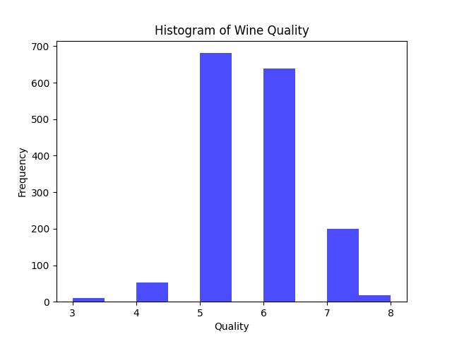

# is477-fall2023-final-project

## Overview
This project focuses on the analysis and visualization of the Wine Quality dataset, specifically the red variant from the Vinho Verde region in Portugal. The dataset, obtained from the UCI Machine Learning Repository, features physicochemical properties of the wine like acidity, sugar content, and alcohol level, along with a quality rating. Our analysis aims to uncover patterns and insights into what factors contribute to the quality of wine. We apply various data analysis techniques, including summary statistics, linear regression modeling, and data visualization, to understand the relationships between different physicochemical properties and wine quality.

## Analysis
Our analysis revealed that certain factors, such as alcohol content and acidity, have a significant influence on wine quality. The regression model indicated a strong relationship between these variables and the quality rating. Visualizations, such as histograms and scatter plots, provided further insights into the distribution of quality ratings and their correlation with key properties.

## Workflow

## Reproducing the Analysis
To reproduce this analysis:
1. Clone the repository: `git clone <https://github.com/Qu4drupleU/is477-fall2023-final-project>`
2.  Run `docker pull caishista/is477-fall2023:final-project` to pull the pre-built image from Docker Hub.
3. Run the Docker container: `docker run caishista/is477-fall2023:final-project`
4. The results will be available in the `results/` directory.

## License
This project is licensed under the [MIT License](LICENSE.txt). 

## References
- Cortez, P., Cerdeira, A., Almeida, F., Matos, T., & Reis, J. (2009). Wine Quality. UCI Machine Learning Repository. https://doi.org/10.24432/C56S3T